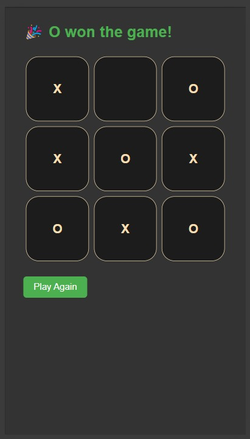
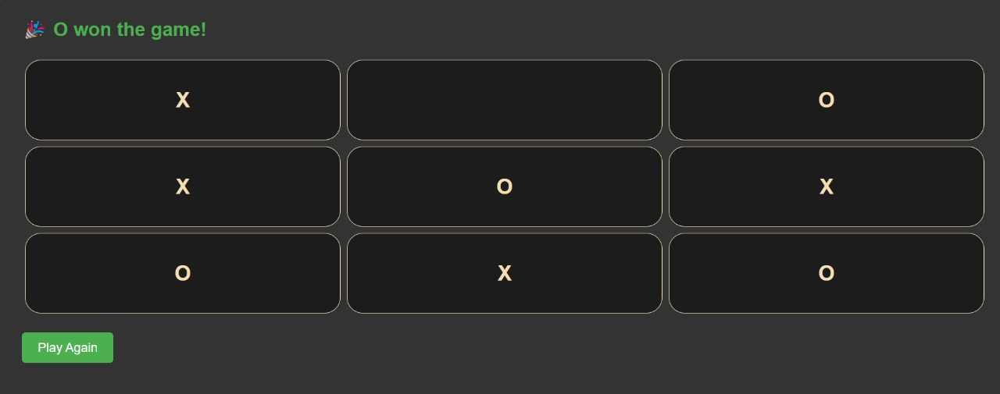

# 🎯 Tic Tac Toe Game with React

A fully functional **Tic Tac Toe** game built using **React**! The game features dynamic gameplay, user feedback, and a reset option to start over.

---

## 🚀 Features

✅ Interactive Tic Tac Toe grid (3x3).  
✅ Displays next player's turn (X / O).  
✅ Detects **Winner** and shows 🎉 celebratory message.  
✅ Detects **Draw** (tie) and shows 🤝 draw message.  
✅ **Play Again** / **Restart Game** button available at all times.  
✅ Blocks further moves after a win is detected.  
✅ Clean and responsive layout for both mobile and desktop devices.  
✅ Full reset functionality to start a fresh game instantly.

---

## 🖥️ Final UI Preview

### 📱 Mobile View:

### 💻 Desktop View:

---

## 🛠️ Tech Stack

- **ReactJS**
- **JavaScript (ES6+)**
- **CSS (Basic Styling)**

---

## 📝 Notes

- Game logic is fully contained within a React `Board` component.
- Game state is managed using `useState`.
- Modular design with separate `Square` component for each grid cell.

---

## 🎮 How to Play

1. Click on any empty square to place **X** or **O**.
2. Alternate turns until a player wins or the board is full.
3. Once the game ends, click **Play Again** to restart.

---

## 💡 What I Learned

- Handling **React State Management** effectively.
- Breaking down UI into reusable components.
- Implementing game logic & conditional rendering in React.
- Building **responsive UI** for different screen sizes.
- Adding **reset functionality** in React apps.

---

>✨ **Next Steps:**  
>> Thinking of adding **scoreboard**, **AI player**, and maybe some cool **animations** for winning/draw scenarios! 🚀

---

Made with ❤️ using React!

